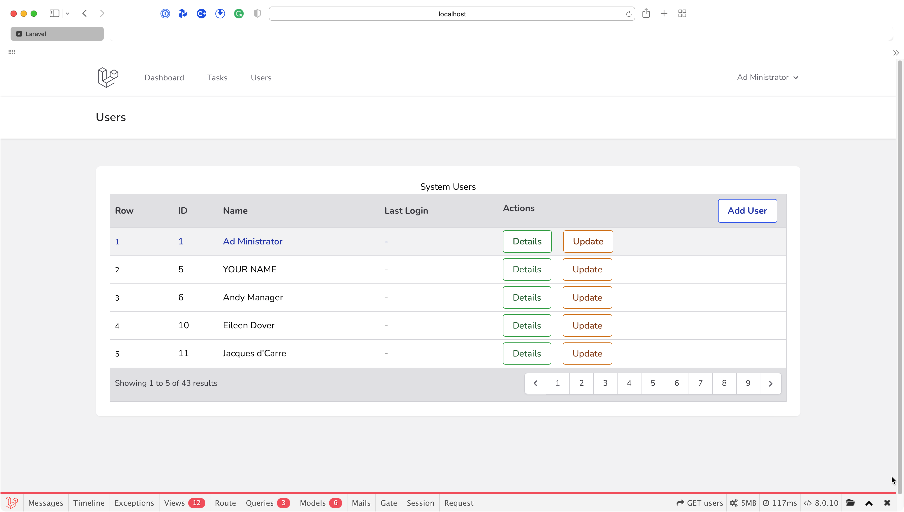

# Users: Browse (`index.blade.php`)

Create a new folder in the application's root folder with the path `/resources/views/users`
and then create a new php file called `index.blade.php`.

In this file we will create the "browse" section of the **BREAD** (or **CRUD**).


*The Browse page in action.*

## Browse: `index.blade.php` file and `index` Route

```html
<?php
/**
 * Filename:    index.blade.php
 * Project:     l8-gate-policies
 * Location:    resources\views\users
 * Author:      Adrian Gould 
 * Created:     08/09/21
 * Description:
 *     Add description here
 */

?>
<x-app-layout>

    <x-slot name="header">
        <h2 class="font-semibold text-xl text-gray-800 leading-tight">
            {{ __('Users') }}
        </h2>
    </x-slot>

    <div class="py-12">
        <div class="max-w-7xl mx-auto sm:px-6 lg:px-8">
            <div class="bg-white overflow-hidden shadow-sm sm:rounded-lg">
                <div class="p-6 bg-white border-b border-gray-200 ">
                    @if ($message = Session::get('success'))
                        <div class="border-green-900 border-2 border-solid bg-green-800
                                        text-white px-2 my-2 py-1 rounded">
                            <p class="flex-1">
                                <i class="fas fa-smile mr-6 pl-2"></i>
                                <span class="align-middle">
                                        {{ $message }}
                                    </span>
                            </p>
                        </div>
                    @endif
                    <div class="overflow-x-auto ">
                        <table
                            class="table w-full border border-0 border-bottom border-gray-300">
                            <caption>System Users</caption>
                            <thead class="bg-gray-200 border border-gray-300 text-gray-700">
                            <tr>
                                <th class="p-2 text-left" scope="col">Row</th>
                                <th class="p-2 text-left" scope="col">ID</th>
                                <th class="p-2 text-left" scope="col">Name</th>
                                <th class="p-2 text-left" scope="col">Last Login</th>
                                <th class="p-2 flex justify-between text-left" scope="col">
                                    <span class="pt-1 mr-2">Actions</span>
                                    <a href="{{ route('users.create') }}"
                                       class="rounded p-2 px-4 mr-2
                                              border border-blue-600 text-blue-800 bg-white
                                              hover:bg-blue-500 hover:text-white hover:border-blue-800
                                              transition-all ease-in-out duration-200">
                                        Add User
                                    </a>
                                </th>
                            </tr>
                            </thead>
                            <tbody>
                            @foreach($users as $key=>$user)
                                <tr class="p-2 m-0 border border-gray-300
                                           hover:bg-blue-100 hover:border-blue-300
                                           transition-all duration-200 ease-in-out
                                           @if($user->id == auth()->user()->id)
                                                bg-gray-100 text-blue-800 font-semibold
                                                hover:bg-blue-200 hover:text-black
                                           @endif">
                                    <td class="p-2 py-3 m-0"><small class="badge"> {{ $key+1 }}
                                        </small></td>
                                    <td class="p-2 py-3 m-0">{{ $user->id }}</td>
                                    <td class="p-2 py-3 m-0">{{ $user->name }}</td>
                                    <td class="p-2 py-3 m-0">
                                        @if(is_null($user->last_login_at))
                                            -
                                        @else
                                            @displayDate($user->last_login_at)
                                        @endif
                                    </td>
                                    <td class="p-2 py-3 m-0" colspan="2">
                                        <a href="{{ route('users.show', [$user->id]) }}"
                                           class="rounded p-2 px-4 mr-4
                                           border border-green-600 text-green-800 bg-white
                                           hover:bg-green-600 hover:text-white
                                           transition-all ease-in-out duration-200">Details</a>
                                        <a href="{{ route('users.edit', ['user'=>$user->id]) }}"
                                           class="rounded p-2 px-4 mr-4
                                      border border-amber-600 text-amber-800 bg-white
                                      hover:bg-amber-500 hover:text-white
                                      transition-all ease-in-out duration-200">Update</a>
                                    </td>
                                </tr>
                            @endforeach
                            </tbody>
                            <tfoot class="bg-gray-200 text-gray-700 border border-gray-300">
                            <tr>
                                <td colspan="5" class="p-2  pb-3 m-0">
                                    {{ $users->links() }}
                                </td>
                            </tr>
                            </tfoot>
                        </table>
                    </div>

                </div>
            </div>
        </div>
    </div>
</x-app-layout>
```

Now we edit the controller for the Users and add the required code for retrieving and showing
them. Open the `/app/http/controllers/UserController.php` file.

Modify the index method to retrieve the users, and paginate the results in groups of 5.

```php
    public function index()
    {
        $users = User::paginate(5)->onEachSide(2);
        return view('users.index', compact(['users']));
    }
```

Remember to add the `use App\Models\User;` line at the top of the file so that the controller
has access to the User model.

### Next: [Users: Read](05-Users-Read.md)
